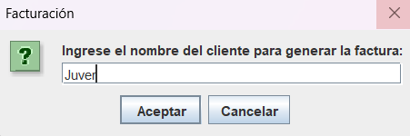
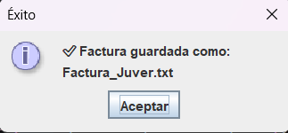

# 💾 Módulo 5: Generación de Facturas (Archivos)

Usamos la clase `FileWriter` para generar comprobantes permanentes en el disco duro.

  
<b>👀 Ver Ejercicio Práctico y Código</b>

   
  El programa pide el nombre del cliente y crea un archivo `.txt` real con su factura detallada.  
  📥 **<a href="ejercicios/Archivos.java">Descargar código del Generador de Facturas</a>**

 

  
  

 

  <h3>🎉 ¡Tutorial Completado! 🎉</h3>
   
  <a href="index.html" class="boton-neon">Volver al Inicio 🏠</a>

