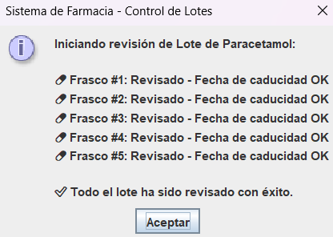

# 🔄 Módulo 1: Control de Lotes (Ciclos)

Los **ciclos** (`for`, `while`) nos permiten automatizar tareas, como verificar la caducidad de cientos de frascos en fracciones de segundo.

  
<b>👀 Ver Ejercicio Práctico y Código</b>

   
  Usamos un bucle `for` para la revisión automática de un lote de Paracetamol, mostrando el reporte en una ventana emergente de Java Swing.  
  📥 **<a href="ejercicios/Ciclos.java">Descargar código del simulador de lotes</a>**

 

  

 

  <a href="metodos.html" class="boton-neon">Siguiente Módulo ➡️</a>

