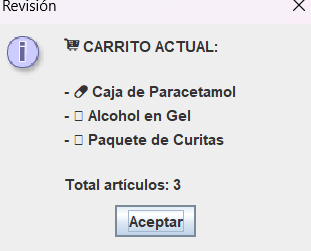
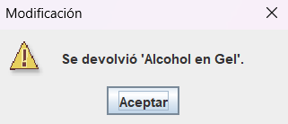

# 🛒 Módulo 4: Carrito de Compras (Listas)

Para manejar compras donde no sabemos cuántos artículos llevará el cliente, usamos **Listas dinámicas** (`ArrayList`).

  
<b>👀 Ver Ejercicio Práctico y Código</b>

   
  Iniciamos agregando productos y luego simulamos retirar uno (`.remove()`) para demostrar cómo la lista ajusta su tamaño.  
  📥 **<a href="ejercicios/Listas.java">Descargar código del Carrito de Compras</a>**

 

  
  

 

  <a href="archivos.html" class="boton-neon">Siguiente Módulo ➡️</a>

