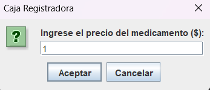
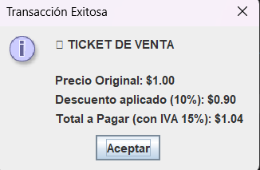
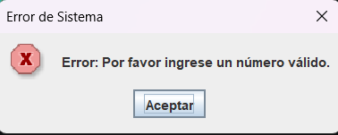

# 📠 Módulo 2: Caja Registradora (Métodos)

Un **método** (función) nos permite encapsular fórmulas, como calcular impuestos, para usarlas muchas veces sin reescribir código.

  
<b>👀 Ver Ejercicio Práctico y Código</b>

   
  Se solicita el precio mediante una ventana. Luego, ese valor pasa por dos métodos: `calcularDescuento()` y `aplicarIVA()`.  
  📥 **<a href="ejercicios/Metodos.java">Descargar código de la Caja Registradora</a>**

 

  
  
  

 

  <a href="matrices.html" class="boton-neon">Siguiente Módulo ➡️</a>

